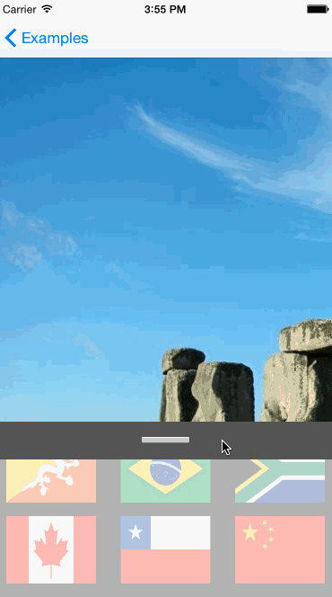

#XLSlidingContainer
---------------
By [XMARTLABS](http://xmartlabs.com).

XLSlidingContainer is a Custom Container Controller that embeds two independent ViewControllers at the same time. One appears at the top half of the screen (we call it upper) and the other shows at the bottom one(lower). In the middle there is a bar that separates them and that can be dragged up and down to maximize or minimize each of the controllers.
When the bar is dragged up the upper ViewController will minimize and the lower one will maximize. When it is dragged down it behaves the other way around.

#####Screenshot of an example using XLSlidingContainer


The embedded controllers have to conform to the XLSlidingContainerViewController protocol to be informed of changes to their display size. This might be of interest to them as they might want to change their appearance and layout when that happens. These functions are optional but will surely be defined in most cases:
```objc
- (void) minimizedController:(CGFloat) diff;
- (void) maximizedController:(CGFloat) diff;
- (void) updateFrameForYPct:(CGFloat)y absolute:(CGFloat)diff;
```
The parameter diff stands for the absolute amounts of points the dragbar moved from the previous call while the "y" parameter in the third function is the percentage of the position of the Dragbar. This percentage is 0 when the controller is minimized and 100 when the controller is maximized.

XLSliderViewController has a datasource and a delegate property. After instantiating this custom controller a datasource -from where the subcontrollers will be retrieved- must be set. Optionally you can change the Dragbar implementing the function "getDragView" as shown in the examples.
```objc
@required
- (UIViewController <XLSlidingContainerViewController>*) getLowerControllerFor:(XLSlidingContainerViewController *)sliderViewController;
- (UIViewController <XLSlidingContainerViewController>*) getUpperControllerFor:(XLSlidingContainerViewController *)sliderViewController;

@optional
- (UIView*) getDragView;
```
The names are pretty self-explanatory.

The delegate is optional but important if you want to customize the XLSlidingContainer.
```objc
- (CGFloat)getUpperViewMinFor:(XLSlidingContainerViewController *)sliderViewController;
- (CGFloat)getLowerViewMinFor:(XLSlidingContainerViewController *)sliderViewController;
- (CGFloat) getLowerExtraDraggableArea:(XLSlidingContainerViewController *)sliderViewController;
- (CGFloat) getupperExtraDraggableArea:(XLSlidingContainerViewController *)sliderViewController;
- (XLSlidingContainerMovementType)getMovementTypeFor:(XLSlidingContainerViewController *)sliderViewController;

-(void)slidingContainerDidBeginDrag:(XLSlidingContainerViewController *)sliderViewController;
-(void)slidingContainerDidEndDrag:(XLSlidingContainerViewController *)sliderViewController;
```

The first two functions define the minimum height each subcontroller gets. By default they are set to one sixth (1/6) and one fourth (1/4) of the window size.
The next two functions are for usability reasons. Sometimes when the Dragbar is small it is difficult to pan on it so with this functions you can increase a bit the surface where the actual panning happens. This is done in the "Instagramlike" example. The default value is 0.
The getMovementTypeFor function is used to get the movement type. Check the "Movement types" section for more details.
The last two functions are called when the user begins and ends dragging the Dragbar. For example, you can change the appearance of the Dragbar in here to show that it is being panned.

For customization reasons there is a view outlet (called navView) in the XLSliderViewController that can be linked to a view if you are working on a storyboard. Otherwise the root view of the controller is used. With this feature it is possible to change the margins of the main view.

####Movement types
Currently there are two movements predefined in XLSlidingContainer which are XLSlidingContainerMovementTypePush and XLSlidingContainerMovementTypeHideUpperPushLower; both push the lower view out of screen while the latter hides the upper view and the former pushes it.
To create a movement that hides the lower view look at the "Instagramlike" example which sets the contentOffset property of its view to scroll up and down according to the Dragbars move.
You can obviously build on this behaviors to create a personalized one for your app.


Installation
-------------

The easiest way to use `XLSlidingContainer` in your app is via [CocoaPods](http://cocoapods.org/ "CocoaPods").

1. Add the following line in the project's Podfile file:
`pod 'XLSlidingContainer', '~> 1.0.0'`.
2. Run the command `pod install` from the Podfile folder directory.


How to use it
--------------

To use XLSlidingContainerViewController follow these steps:

1.  Implement the two controllers you want to embed in the XLSlidingContainerViewController. Keep in mind that they have to conform to the protocol with the same name.

2.  Extend the XLSlidingContainerViewController and implement its datasource methods setting the previous controllers to be the subcontrollers of it. You could also use the base controller and just set its datasource to be one of your controllers that implements the required methods.
You can optionally implement the delegate methods as well.

3.  [Optional] In the storyboard create a view in the XLSlidingContainerViewController that matches the size you want for the main view and link it to the property called "navView" in the XLSlidingContainerViewController.m.
Then create a .xib file for the Dragbar and set it in the datasource function 'getDragView'.


Customization
--------------

The most interesting customizable features are:

* #####You can change the margins of the main view.
  If you are working on a storyboard, just add an UIView to the ViewController whose class is the XLSlidingContainerViewController and set its size to what you want the custom container's size to be. Then link it to the property called "navView" in the controller. Not doing this will make the container occupy the whole screen.

* #####The minimum space each controller gets.
  The delegate of the controller has to implement two methods that define the minimum space each controller gets when minimized. If the delegate is not set then the XLSlidingController will set some default values.

* #####The behavior of the controllers when their layout changes.
  The embedded subcontrollers have to conform to the XLSlidingContainerViewController protocol. By doing so, it will get notified when it is being minimized, maximized and for each pan movement that happens in the main controller. Examples that can be done here are changing the controllers Alpha value or the content offset.

* #####The appearance of the Dragbar.
  By default the XLSlidingContainerViewController comes with a simple darkgray colored Dragbar. You can change this in the datasource by implementing the function:
  ```objc
  - (UIView*) getDragView;
  ```
  You have to return an UIView that can be generated by code or loaded from a .xib file. Look at the examples to see how it can be done.


Examples
--------------

####Instagramlike

This example works in a similar way to the Instagram App where you have images in one controller at the bottom of the screen and another controller at the top of the screen.
In this case we show static images (flags) in the lower ViewController and a ScrollView image in the upper view.
The Dragbar's behavior is defined to hide the lower view and to push the upper view out of screen when they get minimized.
In fact the ViewController at the bottom of the screen is a CollectionViewController and therefore we define a CollectionViewCell class as well.
In this example we extend the XLSlidingContainerViewController and implement the datasource methods as follows:
```objc
- (UIViewController <XLSlidingContainerViewController>*) getUpperControllerFor:(XLSlidingContainerViewController *)sliderViewController{
    return [[ScrollViewController alloc] init];
}
- (UIViewController <XLSlidingContainerViewController>*) getLowerControllerFor:(XLSlidingContainerViewController *)sliderViewController{
    UICollectionViewFlowLayout* collectionViewLayout = [[UICollectionViewFlowLayout alloc] init];
    collectionViewLayout.scrollDirection = UICollectionViewScrollDirectionVertical;
    collectionViewLayout.itemSize = CGSizeMake(90, 60);
    collectionViewLayout.sectionInset = UIEdgeInsetsMake(15, 10.0, 15, 10.0);
    collectionViewLayout.minimumLineSpacing = 15.0;

    CollectionViewController* controller = [[CollectionViewController alloc] initWithCollectionViewLayout:collectionViewLayout];
    return controller;
}

-(XLSlidingContainerMovementType)getMovementTypeFor:(XLSlidingContainerViewController *)sliderViewController{
    return XLSlidingContainerMovementTypePush;
}

-(UIView *)getDragView{
    NSArray* nibContents = [[NSBundle mainBundle] loadNibNamed:@"Exampledragview2" owner:nil options:nil];
    return [nibContents lastObject];
}

#pragma mark - XLSliderViewControllerDelegate

- (CGFloat)getupperExtraDraggableArea:(XLSlidingContainerViewController *)sliderViewController
{
    return 30.f;
}

- (CGFloat)getLowerExtraDraggableArea:(XLSlidingContainerViewController *)sliderViewController
{
    return 30.f;
}

```
So there we set the controllers, defining the cell layout for the CollectionView. Then we set the movement ype to be "push" and we get a beautiful view for our Dragbar. As our Dragbar is not too big we increase the panning surface by 30 to each side.

Then in the CollectionViewController we set the content offset of our view to simulate hiding the lower controller:

```objc
-(void)minimizedController:(CGFloat)diff{
  [self.view setAlpha:0.3];
  CGFloat currentOffset = self.collectionView.contentOffset.y;
  [self.collectionView setContentOffset:CGPointMake(0, MIN(diff + currentOffset,
                                                           MAX(0, self.collectionView.contentSize.height - CGRectGetHeight(self.view.frame)))) animated:NO];
}

-(void)maximizedController:(CGFloat)diff{
  [self.view setAlpha:1.0];
  CGFloat currentOffset = self.collectionView.contentOffset.y;
  [self.collectionView setContentOffset:CGPointMake(0, MAX(currentOffset - diff, 0)) animated:NO];
}
```

And that's it basically

####HideUpper

This example shows another behavior for the Dragbar. In this case the lower ViewController gets pushed out of screen while the upper ViewController hides when minimized.
Here we have a navigation Controller embedded at the top and the same ScrollViewController from the previous example at the bottom.
The root ViewController of the navigation Controller has a simple static Tableview whose rows are countries and clicking on them will produce a segue to another controller containing the flag of the country.
In this example we do not extend the XLSlidingContainerViewController; we just define a datasource for it before we segue to it:
```objc
  XLSlidingContainerViewController* sliderVC = segue.destinationViewController;
sliderVC.dataSource = [[HideUpperDataSource alloc] init];
```

This datasource defines the basics:
```objc
- (UIViewController <XLSlidingContainerViewController>* ) getLowerControllerFor:(XLSlidingContainerViewController * )sliderViewController{
    return [[ScrollViewController alloc] init];
}
- (UIViewController <XLSlidingContainerViewController>* ) getUpperControllerFor:(XLSlidingContainerViewController * )sliderViewController{
    CountryTableViewController* ctvc = [[CountryTableViewController alloc] init];
    return [[SimpleNavigationController alloc] initWithRootViewController:ctvc];
}

-(UIView* )getDragView{
    NSArray* nibContents = [[NSBundle mainBundle] loadNibNamed:@"Exampledragview" owner:nil options:nil];
    return [nibContents lastObject];
}
```
In this case we want our Dragbar to hide the upper controller and we have another view for the Dragbar. It does not look very appealing but it is to show that you can customize it as you want, even its height.

Requirements
-------------

* iOS 7.0 and above
* ARC


Release Notes
--------------

Version 1.0.0 (cocoaPod)

* Initial release


Contributors
-------------
* Mathias Claassen  [mathias@xmartlabs.com](mailto:mathias@xmartlabs.com)
* Santiago Fernandez - [@\_\_pera\_\_](http://twitter.com/__pera__)


XLSlidingContainer was inspired by [Instagram](https://itunes.apple.com/EN/app/instagram/id389801252?mt=8) app.

Contact
--------

Any suggestion or question? Please create a Github issue or reach us out.

[xmartlabs.com](http://xmartlabs.com).
[@xmartlabs](http://twitter.com/xmartlabs "@xmartlabs")
